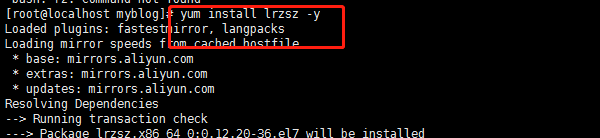

#### 一、个人博客使用docker部署在服务器上步骤

参考链接：

```
https://www.cnblogs.com/lvye001/p/10631276.html
https://www.cnblogs.com/geogre123/articles/9791002.html
```


##### 01、第一步购买服务器和域名

```
服务器已经购买，观望域名
```

###### 参考网址：

```
https://www.cnblogs.com/xueweihan/p/11649630.html
```

##### 1、 安装 python3 到 Centos7， 先安装软件管理包和可能使用的依赖

```
yum -y groupinstall "Development tools"
yum install openssl-devel bzip2-devel expat-devel gdbm-devel readline-devel sqlite-devel
```

##### 2 、下载Pyhton3到/usr/local 目录

```
wget https://www.python.org/ftp/python/3.7.2/Python-3.7.2.tgz
```

##### 3、 解压

```
tar -zxvf Python-3.7.2.tgz
```

##### 4 、进入到解压好的python文件中

```
cd Python-3.7.2
```

##### 5 、编译安装到指定路径

```
./configure --prefix=/usr/local/python3
```

##### 6、 安装python3

```
make

make install
```

可能会报错

```
python3.7.1 编译安装时报错 ModuleNotFoundError: No module named '_ctypes' make: *** [install] 错误 1
```

解决方案：

```
缺少安装依赖，解决方法，安装libffi-devel依赖，再重新编译安装python3.7.1即可成功 
yum -y install libffi-devel 
再重新编译安装
```

##### 7 、安装完成之后 建立软链接 添加变量 方便在终端中直接使用python3

```
ln -s /usr/local/python3/bin/python3.7 /usr/bin/python3
```

这里软链接报错

```
[root@localhost Python-3.7.2]# ln -s /usr/local/python3/bin/python3.7 /usr/bin/python3
ln: failed to create symbolic link ‘/usr/bin/python3’: File exists

```

##### 8 、Python3安装完成之后pip3也一块安装完成，不需要再单独安装一样建立软链接同样给pip3建立软链接

```

```


##### 9 、安装virtualenv, 方便不同版本项目管理

```
pip3 install virtualenv
```


##### 10、 建立软链接

```
ln -s /usr/local/python3/bin/virtualenv /usr/bin/virtualenv3
```

##### 11 、安装成功在根目录下建立两个文件夹，主要用于存放env和网站文件的 （文件创建随意，根据实际需求）。

```
mkdir -p /data/env	# 存放虚拟环境
	
mkdir -p /data/wwwroot	# 存放web项目
```


##### 12 、切换到/data/env/下，创建指定版本的虚拟环境。

```
virtualenv3 --python=/usr/bin/python myblog (项目名)	# 创建虚拟环境


# 然后进入
cd /data/env/qize_demo/bin 

# 进入bin目录后开启虚拟环境，执行命令
source activate	

# 注：(启动后出现 (myblog)，说明是成功进入虚拟环境。)

```


##### 13、 虚拟环境里用pip3安django和uwsgi (留意：uwsgi要安装两次，先在系统里安装一次，然后进入对应的虚拟环境安装一次。)

```
pip3 install django  #（如果用于生产的话，则需要指定安装和你项目相同的版本）

pip3 install uwsgi

# 给uwsgi建立软链接，方便使用

ln -s /usr/local/python3/bin/uwsgi /usr/bin/uwsgi
```

#### 14 在本地项目目录下用下面的命令把当前的环境依赖包导出到requirements.txt文件

```
pip3 freeze > requirements.txt 
```

#### 15 把项目源码压缩打包。把项目上传到服务器对应的目录里(/data/wwwroot/)，解压。

上传文件使用

```
yum install lrzsz -y
然后rz  弹出窗口选择对应文件即可
```



#### 16、我使用的时wind压缩文件为rar，centos下解压rar需要安装软件,  

##### 先确定环境是64位还是32位

```
uname -a
我的64位，没有说明的就是32位
```


##### 001、下载

```
wget http://www.rarlab.com/rar/rarlinux-x64-5.3.0.tar.gz
```


##### 002、安装

```
tar zxvf rarlinux-3.8.0.tar.gz
cd rar
make
解压当前目录：rar x test.rar //解压 test.rar 到当前目录
压缩：rar test.rar ./test/ //将 test目录打包为 test.rar
```


##### 004、安装reqirements安装包时，无法安装，特别是安装mysqlclient==1.4.6时报错

```
cwd: /tmp/pip-install-ctgv8ec_/mysqlclient/
Complete output (12 lines):
/bin/sh: mysql_config: command not found
/bin/sh: mariadb_config: command not found
/bin/sh: mysql_config: command not found
Traceback (most recent call last):
  

```

解决方案：

```python
依次执行下面3句命令：
yum install python-devel
yum install mysql-devel
yum install gcc


```

##### 003、再安装mysqlclient==1.4.6

成功;


#### 17、安装好各种模块后，将项目的mysql数据库导出来并上传到linux上

```
导出Mysql, myblog为你要导出来的数据库名称,直接在cmd界面进行操作

mysqldump -uroot -p password myblog>myblog.sql
```

#### 18、安装mysql

```
安装教程  https://www.cnblogs.com/lzhdonald/p/12511998.html
```

#### 19、安装mysql  我的是64位的系统 ，

下载mysql：

官网5.7版本：

```
https://cdn.mysql.com//Downloads/MySQL-5.7/mysql-5.7.29-1.el7.x86_64.rpm-bundle.tar
```


上传到centos上：

rz 选择文件上传


###### 02、解压mysql压缩包

~~~
tar -xvf mysql-5.7.29-1.el7.x86_64.rpm-bundle.tar
~~~


解压出多个文件：


严格按照顺序安装

```

```

出现报错：

```
warning: mysql-community-libs-5.7.29-1.el7.x86_64.rpm: Header V3 DSA/SHA1 Signature, key ID 5072e1f5: NOKEY
error: Failed dependencies:
	mysql-community-common(x86-64) >= 5.7.9 is needed by mysql-community-libs-5.7.29-1.el7.x86_64
	mariadb-libs is obsoleted by mysql-community-libs-5.7.29-1.el7.x86_64
报错原因是因为centos自带mariadb数据库，需要写在卸载相关库
```

卸载mariadb：

```
rpm -qa|grep mariadb  # 查看mariadb 信息
# 出现信息：
mariadb-devel-5.5.65-1.el7.x86_64
mariadb-libs-5.5.65-1.el7.x86_64

卸载这个包：
mariadb-libs-5.5.65-1.el7.x86_64

```

然后依次安装mysql

```
rpm -ivh mysql-community-common-5.7.29-1.el7.x86_64.rpm

rpm -ivh mysql-community-libs-5.7.29-1.el7.x86_64.rpm

rpm -ivh mysql-community-client-5.7.29-1.el7.x86_64.rpm

rpm -ivh mysql-community-server-5.7.29-1.el7.x86_64.rpm
```

此时执行mysql会报错：

```
ERROR 1045 (28000): Access denied for user 'root'@'localhost' (using passwor:yes)问题
```

我的解决方案是：服务器关机重启，然后输入mysql即可登入mysql

##### 03、mysql设置密码

```
update mysql.user set authentication_string=password('123456') where user='root';
```


然后刷新

```
flush privileges;
```

##### 04、 退出mysql并停止mysql服务,编辑my.cnf配置文件将：skip-grant-tables这一行注释掉

```
systemctl stop  mysqld.service

然后：cd/etc/my.cnf
vim my.cnf
skip-grant-tables 这一行注释掉
```

##### 05、然后重启mysql服务

```
systemctl start mysqld.service
```

##### 06、再次登陆mysql

```
mysql -uroot -p123456
```


##### 07、现在登陆mysql后，执行show databases时，报错

```
ERROR 1820 (HY000): You must reset your password using ALTER USER statement before executing this statement.
```

结局方案：

```
1、设置密码的验证强度等级，设置 validate_password_policy 的全局参数	为 LOW 
   set global validate_password_policy=LOW;

2、只要设置密码的长度小于 3 ，都将自动设值为 4
   set global validate_password_length=4;
 
3、完成之后再次执行修改密码语句即可成功
	alter user 'root'@'localhost' identified by '123456';
 
```

执行show databases；显示成功；


##### 08、现在需要将本地导出的myblog.sql数据导入到数据库

```
我已经将数据库上传到 centos的 /data/wwwroot/myblog.sql  路径下

那么我登陆mysql数据库：用source命令导入数据库，执行以下命令：
新建数据库名：create database myblog;
切换到新建的数据库下：use myblog;
设置编码模式：set names utf8;
导入数据库：source /data/wwwroot/myblog.sql  # (后面是数据库的路径)
```


#### 20、使用 python3  manage.py runserver 运行下django，看是否成功

```
进入到项目的根目录下
cd /data/wwwroot/myblog  # manage.py 所在的文件夹

注意：此时的项目settings.py 中的数据库配置的账号密码要和centos中配置的账号密码一致

然后运行python3 manage.py runserver  
```

正常运行：但是浏览器输入http://127.0.0.1:8000/ 还是无法链接


#### 21、在项目根目录里添加uwsgi配置文件 (myblog.xml)

```
模板：
<uwsgi>       

 <socket>127.0.0.1:8070/</socket><!-- 内部端口，自定义 --> 

 <chdir>/data/wwwroot/qize_demo/</chdir><!-- 项目路径 -->            

 <module>qize_demo.wsgi</module> 

 <processes>4</processes> <!-- 进程数 -->     

 <daemonize>uwsgi.log</daemonize><!-- 日志文件 -->

</uwsgi>

我的uwsgi配置文件内容为：

<uwsgi>       

 <socket>127.0.0.1:8070/</socket>
 <chdir>/data/wwwroot/myblogo/</chdir> 
 <module>myblog.wsgi</module> 
 <processes>4</processes>   
 <daemonize>uwsgi.log</daemonize>

</uwsgi>

```

#### 22、配置nginx，要先安装nginx才行

##### 01、安装nginx,通过Yum安装Nginx

```
cd /etc/yum.repos.d    #切换到yum安装源文件目录
vi nginx.repo   #创建一个安装包源

```

##### 02、把以下内容复制进去，保存退出

```
[nginx-stable]

name=nginx stable repo

baseurl=http://nginx.org/packages/centos/$releasever/$basearch/

gpgcheck=1

enabled=1

gpgkey=https://nginx.org/keys/nginx_signing.key

[nginx-mainline]

name=nginx mainline repo

baseurl=http://nginx.org/packages/mainline/centos/$releasever/$basearch/

gpgcheck=1

enabled=0

gpgkey=https://nginx.org/keys/nginx_signing.key
```

##### 03、然后查看一下是否成功加载了这个安装源

```
yum repolist
```

此时报错：

```
Cannot find a valid baseurl for repo: base/7/x86_64
```

报错截图：


参考：https://blog.csdn.net/qq_32811865/article/details/92002278?utm_medium=distribute.pc_relevant.none-task-blog-BlogCommendFromMachineLearnPai2-1.nonecase&depth_1-utm_source=distribute.pc_relevant.none-task-blog-BlogCommendFromMachineLearnPai2-1.nonecase

如果在，在第二步将enabled修改为enabled=1，一直到第5 步骤出错的时候，返回过去第一步，将enabled=0 修改为0。然后再yum list，则没有报错了


但是在安装nginx的时候还是会报错：

```python
Loaded plugins: fastestmirror, langpacks
Loading mirror speeds from cached hostfile
There are no enabled repos.
 Run "yum repolist all" to see the repos you have.
 To enable Red Hat Subscription Management repositories:
     subscription-manager repos --enable <repo>
 To enable custom repositories:
     yum-config-manager --enable <repo>

```

#### 23、在baidu多种方案还是不行了之后，放弃用yum安装nginx

```
将nginx-1.6.2.tar.gz 文件下载在/data/  文件夹下
解压到,进入到虚拟环境 mublog下  将nginx文件解压到 /usr/local 下
 tar -zxvf nginx-1.6.2.tar.giz  /usr/local 
```

