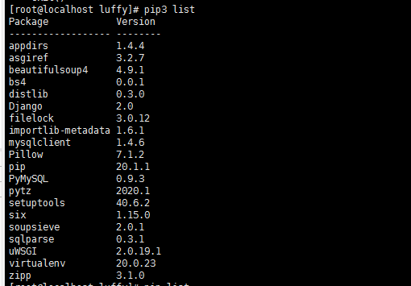

#### 一、项目部署

参考博客：

```
https://www.cnblogs.com/lvye001/p/10631276.html
```


##### 第一步：上传项目到centos

```
rz  然后选择压缩包上传
```

##### 第二步：创建luffy文件夹

```
mkdir luffy 
```


###### 001、将路飞的项目前后端的项目压缩文件移动到luffy文件夹下

```
mv lufei.rar /luffy
mv luffy.rar /luffy

```


##### 第三步：安装python3，在centos界面使用python3说明安装成功

````

````


```
    wget  https://www.python.org/ftp/python/3.6.6/Python-3.6.6.tgz
```


```
python
```

###### 002、解压python压缩文件

```
tar -zxvf Python-3.6.6.tgz 
```


解压完成


###### 003、进入解压的python文件夹

```
cd Python-3.6.6
```


解压后的文件

```
ls
```


######  004、编译安装，先指定安装目录为指定安装目录为/opt/python36

```
./configure --prefix=/opt/python36   # 指定安装目录为/opt/python36
```


###### 005、编译

```
make   # 相当于把源码包里面的代码编译成linux服务器可以识别的代码
```

###### 006、5编译安装,此步才会最终生成 /opt/python36/

```
make install
```

```
5 6 步骤可以合并: 
make && make install  # 先进行make，执行完成之后，才开始执行make install
```


此时查看/opt/

```
cd /opt  # 可以看到出现了python36的文件夹
```


输入python3，说明安装成功了


也可能出现：

```
-bash: python3: command not found
那就需要安装各种依赖包，百度一下就能找到,然后再重新编译安装
```


007、将安装路径添加到centos的path下

```
~/.bash_profile  # 这个是用户环境变量配置文件
/etc/profile  # 系统环境变量配置文件
```

修改/etc/profile系统环境变量配置文件，

```
cd /etc
vim profile
```

添加以下内容

```
export PATH=$path:/opt/python36/bin:/usr/local/sbin:/usr/local/bin:/usr/sbin:/usr/bin:/root/bin
```


```
注意:  一定要将python3的目录放在第一位

​            注意:  一定要将python3的目录放在第一位

​            注意:  一定要将python3的目录放在第一位

​            
```

为了永久生效path设置，需要,重载配置文件/etc/profile

```
source /etc/profile
```


##### 第四步：安装Django，这里安装的是django2.0

```
pip3 install -i https://pypi.douban.com/simple django==2.0
```


pip3 list,可能需要升级pip

```
pip3 install --upgrade pip
```

安装了python3，但是centos 里面是默认安装的python2.在python3种我安装了django，但是使用

```
django-admin startproject mysite  提示命令行不存在，这个时候可能是python的路径有问题，上名的路径我是又修改了的，所以应该不会再出现这个问题
```


pip3 list



为了验证django是否安装成功了，我在 /opt 目录下新建一个djang项目：

在root/目录的下的opt目录下新建一个django的项目，然后启动该项目。

```
[root@tom opt]# django-admin startproject mysite
[root@tom opt]# ls
mysite  python36  rh
[root@tom opt]# cd mysite
[root@tom mysite]# ls
manage.py  mysite
# 启动一定要指定0.0.0.0：8000 同时要修改settings.py文件的host 和关闭防火墙

关闭防火墙 ：systemctl stop firewalld.service

[root@tom mysite]# python3 manage.py runserver 0.0.0.0:8000 
```


启动时还报错：

```
    from _sqlite3 import *
ModuleNotFoundError: No module named '_sqlite3'

```


出现原因：可能是python版本问题，因为我装了python3，将其设置为默认解释其了

```
我重新默认了解释器为python2 并进行安装  yum install sqlite-devel
```

```
File "/usr/libexec/urlgrabber-ext-down", line 28  https://blog.csdn.net/qq_34272964/article/details/87178724

出现上面 问题是我在安装python3.7版本，让python2和python3共存，没有修改/usr/libexec/urlgrabber-ext-down文件，只需要将#! /usr/bin/python2 修改成 #! /usr/bin/python2.7即可。
```


按照提示的 网站进行用浏览器进行访问，发现访问不到：


于是我们给其指定一个ip

python3  manage.py  runserver  0.0.0.0:8000    运行后


然后再访问这个显示的地址 本机的ip加上指定的端口号  <http://192.168.130.68:8000/>

```
127.0.0.1 本机环回地址
192.168.12.56 本机对外IP地址
0.0.0.0 本机环回地址 127.0.0.1加上192.168.12.56

```


发现还是访问不到，出现错误的原因是：Django项目的settings下需要设置host:

如果是在线的腾讯云服务器，则需要些服务器的ip


启动：


然后再使用本机地址加上指定端口8000进行访问，发现事实访问不到，此时可能防火墙还未关闭，关闭防火墙，

关闭防火墙后再重启：出现下面的页面，说明host文件忘记添加了


```
之前我已经设置了，为vmware为NAT模式，
然后关闭防火墙：systemctl stop firewalld.service
```

此时再检查setttins.py文件的host


再次重启运行：可以运行了


##### 第五步：安装mkvirtualenv 虚拟环境

```
cd /opt   # opt目录就是存储安装包的
pip3 install virtualenv   
pip3 install --upgrade virtualenv==16.7.9 # 指定安装这个版本，不然会报错 package。。
```


此时 我在 root目录下创建一个文件夹  Myproject

```
cd /
mkdir Myproject
```

然后：

```
virtualenv --no-site-packages --python=/opt/python36/bin/python3  env01  #得到独立第三方包的环境，并且指定解释器是python3
```

报错：

```
virtualenv: error: unrecognized arguments: --no-site-packages
SystemExit: 2

```


原因：其实就死版本问题

```
--no-site-packages   没有这个参数，是virtualenv版本问题
```

安装指定版本：

```
pip3 install --upgrade virtualenv==16.7.9
```


然后进行虚拟机创建

```
进入创建的Myproject 目录
cd  Myproject

```

创建虚拟环境：

进入创建的Myproject目录下，可以看到之前创建的两个虚拟环境


己想进入的那个虚拟环境


然后执行source  activate 进入虚拟环境，可以看到命令行之前有虚拟环境的名称表示进入虚拟环了。

```
cd /bin
source activate  # 启动这个虚拟环境
```


```
这个是是上面的简写：
source venv/bin/activate
```

source venv/bin/activate#此时进入虚拟环境(venv)Myproject

退出venv环境

```
deactivate
```

在虚拟环境下安装python包，使用pip3

##### 第六步 安装virtualenvwrapper，用来管理虚拟环境

######  001、安装virtualenvwrapper

```
	pip3 install virtualenvwrapper
```


###### 002、设置Linux的用户个人配置文件


```l
vim ~/.bash_profile  # 直接编辑这个文件
添加以下几行内容
WORKON_HOME=~/Envs
VIRTUALENVWRAPPER_VIRTUALENV_ARGS='--no-site-packages'
VIRTUALENVWRAPPER_PYTHON=/opt/python36/bin/python3
source /opt/python36/bin/virtualenvwrapper.sh
```


###### 003、重新读取此环境变量文件

````
source ~/.bash_profile
````


###### 004、virtualenvwrapper的基本使用：

```
1. 创建一个虚拟环境：
$ mkvirtualenv my_django115
这会在 ~/Envs 中创建 my_django115 文件夹。

2. 在虚拟环境上工作：激活虚拟环境my_django115
$ workon my_django115

3. 再创建一个新的虚拟环境
$ mkvirtualenv my_django2

virtualenvwrapper 提供环境名字的tab补全功能。
当有很多环境， 并且很难记住它们的名字时，这就显得很有用。

4. workon还可以任意停止你当前的环境，可以在多个虚拟环境中来回切换
workon django1.15
workon django2.0

5. 也可以手动停止虚拟环境
deactivate

6. 删除虚拟环境，需要先退出虚拟环境
rmvirtualenv my_django115
```


##### 第七步：安装mariadb(mysql)

```
https://www.cnblogs.com/tiger666/articles/10259269.html
```

###### 001、使用官方源安装mariadb

```
教程：
https://www.cnblogs.com/tiger666/articles/10259269.html
https://www.cnblogs.com/yhongji/p/9783065.html
```

###### 002、 使用官方源安装mariadb，首先在 RHEL/CentOS 和 Fedora 操作系统中添加 MariaDB 的 YUM 配置文件 MariaDB.repo 文件。

刚开始时没有的，需要添加

```
vim /etc/yum.repos.d/MariaDB.repo
添加repo仓库配置内容
[mariadb]
name=MariaDB
baseurl=http://yum.mariadb.org/10.1/centos7-amd64
gpgkey=https://yum.mariadb.org/RPM-GPG-KEY-MariaDB
gpgcheck=1
```

###### 003、 当 MariaDB 仓库地址添加好后，一条命令安装官方的最新版本mariadb数据库

```
yum install MariaDB-server MariaDB-client -y
```

###### 004、**配置MariaDB**

```
[root@mini ~]# systemctl start mariadb  # 开启服务
[root@mini ~]# systemctl enable mariadb  # 设置为开机自启动服务
```

###### 005、首次安装需要进行数据库的配置，命令都和mysql的一样

```
mysql_secure_installation
```

###### 006、配置时出现的各个选项

```
# 第一次进入还没有设置密码则直接回车
Enter current password for root (enter for none):  # 输入数据库超级管理员root的密码(注意不是系统root的密码)，第一次进入还没有设置密码则直接回车

Set root password? [Y/n]  # 设置密码，y

New password:  # 新密码
Re-enter new password:  # 再次输入密码

Remove anonymous users? [Y/n]  # 移除匿名用户， y

Disallow root login remotely? [Y/n]  # 拒绝root远程登录，n，不管y/n，都会拒绝root远程登录

Remove test database and access to it? [Y/n]  # 删除test数据库，y：删除。n：不删除，数据库中会有一个test数据库，一般不需要

Reload privilege tables now? [Y/n]  # 重新加载权限表，y。或者重启服务也许
```

测试是否能够登录成功，出现 MariaDB [(none)]> 就表示已经能够正常登录使用MariaDB数据库了

```
[root@mini ~]# mysql -u root -p
Enter password:
Welcome to the MariaDB monitor.  Commands end with ; or \g.
Your MariaDB connection id is 8
Server version: 5.5.60-MariaDB MariaDB Server

Copyright (c) 2000, 2018, Oracle, MariaDB Corporation Ab and others.

Type 'help;' or '\h' for help. Type '\c' to clear the current input statement.

MariaDB [(none)]>
```

###### 007、**设置MariaDB字符集为utf-8**

```
一、修改配置文件/etc/my.cnf

vi /etc/my.cnf

在[mysqld]标签下添加

#character
init_connect='SET collation_connection = utf8_unicode_ci'
init_connect='SET NAMES utf8'
character-set-server=utf8
collation-server=utf8_unicode_ci
skip-character-set-client-handshake

二、配置文件/etc/my.cnf.d/client.cnf
vi /etc/my.cnf.d/client.cnf

在[client]下添加

#character
default-character-set=utf8


三、配置文件/etc/my.cnf.d/mysql-clients.cnf

 vi /etc/my.cnf.d/mysql-clients.cnf

在[mysql]中添加

#character

default-character-set=utf8


四、重启MariaDB服务

service mariadb restart


五、查看字符集
show variables like "%character%";show variables like "%collation%";

```


##### 第八步：安装redis

###### 1.下载redis源码

```
wget http://download.redis.io/releases/redis-4.0.10.tar.gz
```


###### 2.解压缩

```
tar -zxf redis-4.0.10.tar.gz
```


###### 3.切换redis源码目录

```
cd redis-4.0.10
```


###### 4.编译源文件

````
make
````


###### 5.编译好后，src/目录下有编译好的redis指令


###### 6.make install 安装到指定目录，默认在/usr/local/bin

```
make install prefix=/opt/redis4.0
```


###### 7 创建一个专门存放redis配置文件目录


###### 8、在/opt/redis_conf/ 下配置完上诉配置文件 vim redis-6379.conf   

###### 启动时会提示没有 /data/6379这个文件，需要手动创建，后续 在任何目录下，只要执行这个路径，redis就可以被启动了 

```
mkdir /opt/redis_conf
vim redis-6379.conf
写入以下配置
port 6379
daemonize yes
pidfile /data/6379/redis.pid  #/data/6379  这个文件需要创建
loglevel notice
logfile "/data/6379/redis.log"
protected-mode yes
```

在root目录创建data目录

```
mkdir -p /data/6379
```


然后再执行 redis-server /opt/redis_conf/redis-6379.conf   将这个路径指定为启动redis的目录。

```
 redis-server /opt/redis_conf/redis-6379.conf 
```

后续 在任何目录下，只要执行这个路径，redis就可以被启动了 

```
netstat -tunlp 查看端口号码是否启动。
```


###### 9、redis配置文件详解

```
port 6379                         # 运行在6379的redis数据库实例
daemonize yes                     # 后台运行redis  
pidfile /data/6379/redis.pid      # 存放redis pid的文件
loglevel notice                   # 日志等级
logfile "/data/6379/redis.log"    # 指定redis日志文件的生成目录
dir /data/6379                    # 指定redis数据文件夹的目录
protected-mode yes                # 安全模式
requirepass   haohaio             # 设置redis的密码
```


##### 第九步：nginx编译安装

###### 001、卸载nginx

```
yum remove nginx
```

###### 002、 安装所需要的依赖库

```
yum install -y gcc patch libffi-devel python-devel zlib-devel bzip2-devel openssl openssl-devel ncurses-devel sqlite-devel readline-devel tk-devel gdbm-devel db4-devel libpcap-devel xz-devel
```


###### 003  下载nginx安装源码包
wget -c https://nginx.org/download/nginx-1.12.0.tar.gz


######  004\.解压缩源码

```
tar -zxvf nginx-1.12.0.tar.gz
```


###### 005.配置，编译安装

```
cd nginx-1.12.0/

./configure --prefix=/opt/nginx112
```


```
make && make install 
```


###### 006 .启动nginx，进入sbin目录,找到nginx启动命令


```
cd /opt/nginx112/sbin
./nginx #启动
./nginx -s stop #关闭
./nginx -s reload # 平滑重启 ，修改了nginx.conf之后，可以不重启服务，加载新的配置
或者  /opt/nginx112/sbin/nginx -s reload  # 绝对路径平滑重启
```


启动：


然后使用本机的服务器ip访问：如果有线上服务器就用线上服务器的外网ip访问，不需要加 端口号


###### 007 nginx的目录结构


######  008  nginx配置文件详解 


```
#定义nginx工作进程数
worker_processes  5;
#错误日志
#error_log  logs/error.log;
#http定义代码主区域
http {
    include       mime.types;
    default_type  application/octet-stream;
    #定义nginx的访问日志功能
    #nginx会有一个accses.log功能，查看用户访问的记录
    log_format  main  '$remote_addr - $remote_user [$time_local] "$request" '
                      '$status $body_bytes_sent "$http_referer" '
                      '"$http_user_agent" "$http_x_forwarded_for"';

    #开启日志功能
    access_log  logs/access.log  main;
    sendfile        on;
    keepalive_timeout  65;
    #开启gzip压缩传输
    gzip  on;
    #虚拟主机1  定义一个 斗鱼网站 
    server {
        #定义nginx的访问入口端口，访问地址是  192.168.11.37:80
        listen       80;
        #定义网站的域名www.woshidouyu.tv
        #如果没有域名，就填写服务器的ip地址  192.168.11.37
        server_name  www.woshidouyu.tv;
        #nginx的url域名匹配
        #只要请求来自于www.woshidouyu.tv/111111111
        #只要请求来自于www.woshidouyu.tv/qweqwewqe
        #最低级的匹配，只要来自于www.woshidouyu.tv这个域名，都会走到这个location
        location / {
            #这个root参数，也是关键字，定义网页的根目录
            #以nginx安装的目录为相对路径  /opt/nginx112/html 
            #可以自由修改这个root定义的网页根目录
            root   html;
            #index参数定义网站的首页文件名，默认的文件名
            index  index.html index.htm;
        }
        #错误页面的优化(只要是遇到前面4系列的错误，就会直接跳转到相对目录下的40x.html页面)
        error_page  400 401  402  403  404   /40x.html;
    }
}
```

######  009、  跑一个斗鱼网站出来

```
    server {
        listen       80;
        server_name  www.qishi2douyu.com;
        #access_log  logs/host.access.log  main;
        location / {
            root   /opt/qishi2douyu/;
            index  index.html index.html;
        }

        #error_page  404              /404.html;
        error_page   500 502 503 504  /50x.html;
        location = /50x.html {
            root   html;
        }
    }

```


#### 二、实际部署myblog项目到centos：创建myblog的专用虚拟环境进行项目的部署

一个非常详细的部署博客：

```
https://www.django.cn/article/show-4.html#banqian  # 这个比较详细点
https://www.jianshu.com/p/956debe2891d
```

在root目录创建一个myblog目录，将 项目文件压缩后，和requirements.txt,myblog.sql一并上传到这个目录


前提：

###### (1) 收集静态文件 ,修改settings.py配置文件， 加入以下一行配置 STATIC_ROOT='/opt/myblog/static'

```
STATIC_ROOT='/opt/myblog/static'

```

###### (2)  创建静态文件存放目录/opt/myblog/static

```
mkdir -p /opt/myblog/static
```

###### (3)  一条命令收集django项目下面的所有静态文件(切换到存放luffy后端有manage.py的文件下),可以在虚拟环境下收集

```
python3 manage.py collectstatic
```


###### 001、备份本地数据库和导出项目使用的安装包

```
将本地的django项目的数据库备份出来，进入mysql，使用命令行导出
将mylog这个数据库导出到d盘的615文件夹下的myblog.sql

mysqldump -h localhost -u root -p myblog >d:\615\myblog.sql


导出项目使用的安装包
pip3 freeze > requirements.txt

```

###### 002、专门创建一个myblog的文件夹来保存项目和requirements.txt和myblog.sql

```
在 root/ 新建一个myblog文件夹
[root@localhost /]# mkdir myblog
```


###### 003、使用rz命令上传文件

```
先安装yum install lrzsz -y 

rz  
```


###### 004、由于上传的项目是rar，所以需要解压

```
下载解压软件
wget http://www.rarlab.com/rar/rarlinux-x64-5.3.0.tar.gz
安装
tar zxvf rarlinux-x64-5.3.0.tar.gz

cd rar
make
解压当前目录：rar x test.rar //解压 test.rar 到当前目录
压缩：rar test.rar ./test/ //将 test目录打包为 test.rar
```


###### 005、创建新的虚拟环境

```
mkvirtualenv myblog
```

在虚拟环境下安装mysqlclient报错，主要错误：

```
OSError: mysql_config not found
```

```
   ERROR: Command errored out with exit status 1:
     command: /opt/python36/bin/python3 -c 'import sys, setuptools, tokenize; sys.argv[0] = '"'"'/tmp/pip-install-qykisc85/mysqlclient/setup.py'"'"'; __file__='"'"'/tmp/pip-install-qykisc85/mysqlclient/setup.py'"'"';f=getattr(tokenize, '"'"'open'"'"', open)(__file__);code=f.read().replace('"'"'\r\n'"'"', '"'"'\n'"'"');f.close();exec(compile(code, __file__, '"'"'exec'"'"'))' egg_info --egg-base /tmp/pip-pip-egg-info-q5jii0tc
         cwd: /tmp/pip-install-qykisc85/mysqlclient/
    Complete output (12 lines):
    /bin/sh: mysql_config: command not found
    /bin/sh: mariadb_config: command not found
    /bin/sh: mysql_config: command not found
    Traceback (most recent call last):
      File "<string>", line 1, in <module>
      File "/tmp/pip-install-qykisc85/mysqlclient/setup.py", line 16, in <module>
        metadata, options = get_config()
      File "/tmp/pip-install-qykisc85/mysqlclient/setup_posix.py", line 61, in get_config
        libs = mysql_config("libs")
      File "/tmp/pip-install-qykisc85/mysqlclient/setup_posix.py", line 29, in mysql_config
        raise EnvironmentError("%s not found" % (_mysql_config_path,))
    OSError: mysql_config not found
    ----------------------------------------
ERROR: Command errored out with exit status 1: python setup.py egg_info Check the logs for full command output.
```


解决方案：

```
先安装mysql-deve , yum install mysql-devel
会自动找到mriadb-deve 进行安装
再安装mysqlclient    
pip3 install mysqlclient==1.4.6
```


安装上面之后可能还会报错：

```
sl -lcrypto -o build/lib.linux-x86_64-3.6/MySQLdb/_mysql.cpython-36m-x86_64-linux-gnu.so
    /usr/bin/ld: cannot find -lssl
    /usr/bin/ld: cannot find -lcrypto
    collect2: error: ld returned 1 exit status
    error: command 'gcc' failed with exit status 1

```


安装运行库：

```
yum install gcc libffi-devel python-devel openssl-devel -y
```


再安装：mysqlclient==1.4.6

```
pip3 install mysqlclient==1.4.6
```


###### 将myblog.sql 数据导入到centos上的mariadb数据库中

```
cd /myblog  # 有myblog.sql文件的文件夹下
然后进入mysql创建一个数据库
mysql -uroot -p 数据密码登陆
然后：
create database myblog;
接着退出mysql

执行：
[root@localhost myblog]# mysql -uroot -p myblog < myblog.sql
输入密码，然后进去查看
```


运行项目：会报错

项目部署参考博客：

```
https://www.cnblogs.com/djangocn/p/9538551.html
```


```
    fn(*args, **kwargs)
  File "/opt/python36/lib/python3.6/site-packages/django/core/management/commands/runserver.py", line 123, in inner_run
    self.check_migrations()
  File "/opt/python36/lib/python3.6/site-packages/django/core/management/base.py", line 427, in check_migrations
    executor = MigrationExecutor(connections[DEFAULT_DB_ALIAS])
  File "/opt/python36/lib/python3.6/site-packages/django/db/migrations/executor.py", line 18, in __init__
    self.loader = MigrationLoader(self.connection)
  File "/opt/python36/lib/python3.6/site-packages/django/db/migrations/loader.py", line 49, in __init__
    self.build_graph()
  File "/opt/python36/lib/python3.6/site-packages/django/db/migrations/loader.py", line 267, in build_graph
    raise exc
  File "/opt/python36/lib/python3.6/site-packages/django/db/migrations/loader.py", line 241, in build_graph
    self.graph.validate_consistency()
  File "/opt/python36/lib/python3.6/site-packages/django/db/migrations/graph.py", line 243, in validate_consistency
    [n.raise_error() for n in self.node_map.values() if isinstance(n, DummyNode)]
  File "/opt/python36/lib/python3.6/site-packages/django/db/migrations/graph.py", line 243, in <listcomp>
    [n.raise_error() for n in self.node_map.values() if isinstance(n, DummyNode)]
  File "/opt/python36/lib/python3.6/site-packages/django/db/migrations/graph.py", line 96, in raise_error
    raise NodeNotFoundError(self.error_message, self.key, origin=self.origin)
django.db.migrations.exceptions.NodeNotFoundError: Migration blog.0001_initial dependencies reference nonexistent parent node ('auth', '0011_update_proxy_permissions')

```

###### 出现错误的原因，django的版本问题，centos里面是2.0的，我的需要升级到3.0版本

```
pip3 install --upgrade Django==3.0.6
```

###### 重新进入项目文件，启动项目,需要进入虚拟环境运行

```
python3 manage.py runserver 0.0.0.0:8000
```

###### 然后设置项目的settings.py文件的host

```
ALLOWED_HOSTS = ["*"]
```


启动没报错：，


浏览器使用当前ip加上指定端口访问，发现访问不到,这里使用manage.py 访问需要加端口的访问的


###### 关闭防火墙：再重启项目，可以访问到了,当然，项目中settings.py的 修改为ALLOWED_HOSTS = ["*"]

```
然后关闭防火墙：systemctl stop firewalld.service   # 线上服务器好像不用关闭防火墙
```


###### 005、配置uwsgi

第一步：进入所在的myblog虚拟环境，安装uwsgi

```
workon myblog
pip3 install uwsgi
```

#### 2 uwsgi 启动测试文件

```
(1) 创建一个testqishi2.py
vim testqishi2.py
(2) 写入以下几行代码
def application(env, start_response):
    start_response('200 OK', [('Content-Type','text/html')])
    return [b"Hello World"] # python3
(3) 通过uwsgi命令将测试文件跑起来
uwsgi --http :9000 --wsgi-file testqishi2.py
uwsgi --http :8000 --wsgi-file testqishi.py
(4) 测试通过自己本机的IP+端口访问
http://192.168.12.56:9000

```


##### 3 uwsgi启动django项目

```
uwsgi --http :9000 --module myblog.wsgi
```

##### 用uwsgi启动项目，必须要进入到后端django的项目下启动，在项目有manage.py的层面


我自己的启动命令是：

```
# 说明是启动myblog这个文件夹下的这个wsgi文件，启动项目用module，启动文件用file
uwsgi --http :9000 --module myblog.wsgi 
```

进入到项目的manage.py层面，运行,指定端口为9000

```python
(myblog) [root@localhost myblog]# uwsgi --http :9000 --module myblog.wsgi
```


浏览器当前ip+自己指定端口9000，发现没有css等基本样式,下一次运行有了css样式

```
http://192.168.1.100:9000/
```


###### 使用uwsgi热加载来启动项目，启动成功

```
uwsgi --http :9000 --module myblog.wsgi --py-autoreload=1
```


###### 使用uwsgi配置文件启动django项目 

创建一个配置文件uwsgi.ini(注意，这个配置文件不管放在哪里都可以，但是启动的时候，需要找到这个配置文件)
我放在  myblog/myblog  这个文件夹下


```python
vim uwsgi.ini

#socket和http任选其一  WORKON_HOME=~/Envs
#我安装虚拟环境的时候设置了安装路径    ~/Envs/myblog,但是这里的home 路径却是 /root, 
命令行  cd /root  是有Envs目录的
[uwsgi]
chdir           = /myblog/myblog/
module          = myblog.wsgi
home            = /root/Envs/myblog
master          = true
processes       = 1
socket          = 0.0.0.0:9000    
#http            = 0.0.0.0:9000
vacuum          = true
```

过指定uwsgi.ini配置文件把django跑起来(myblog的ini文件在myblog/myblog/)

```
uwsgi uwsgi.ini
```

只使用uwsgi.ini 启动django项目的时候，前端使用线上服务器加端口访问的时候，前端会显示”该网页无法正常运作“  这是因为，只使用uwsgi配置的时候，应该选择  ”运行一个http服务端，就用这个http参数” ,当然现实的时没有css样式

```
有时配置好uwsgi.ini后，前端
#如果你使用了nginx，做反向代理，必须填写socket链接，而不是http参数
socket          = 0.0.0.0:8000
#如果你不用nginx，直接使用uwsgi，运行一个http服务端，就用这个http参数
http = 0.0.0.0:8000
```


此时启动报错：

```python
*** WARNING: you are running uWSGI as root !!! (use the --uid flag) *** 
Python version: 3.6.6 (default, Jul  3 2020, 03:51:29)  [GCC 4.8.5 20150623 (Red Hat 4.8.5-36)]
Set PythonHome to /root/Envs/myblog
Fatal Python error: Py_Initialize: Unable to get the locale encoding
ModuleNotFoundError: No module named 'encodings'

Current thread 0x00007fcea40a2880 (most recent call first):
Aborted (core dumped)

```


出现的原因：

````
因为这里使用的时centos自带的python2，不是我指定的python3，需要在创建虚拟环境的时候指定使用python3
所以需要修改默认的python解释器
参考链接：https://www.jianshu.com/p/1193b1dbaf95
但是在换成解释器后，再创建虚拟环境的时候，会报错，所以我只能重新安装虚拟环境和虚拟环境virtualevewrap
然后创建虚拟环境，重新下载项目需要的安装包。
这时可以测试在虚拟环境下 查看   pyhont版本

上诉的解决方案：

````


````
Fatal Python error: Py_Initialize: Unable to get the locale encoding
ModuleNotFoundError: No module named 'encodings'

````

也出现了这个错误：

```python
detected max file descriptor number: 100001
lock engine: pthread robust mutexes
thunder lock: disabled (you can enable it with --thunder-lock)
uwsgi socket 0 bound to TCP address 0.0.0.0:9000 fd 3
uWSGI running as root, you can use --uid/--gid/--chroot options
*** WARNING: you are running uWSGI as root !!! (use the --uid flag) *** 
Python version: 3.6.6 (default, Jul  5 2020, 00:02:08)  [GCC 4.8.5 20150623 (Red Hat 4.8.5-39)]
!!! Python Home is not a directory: ~/Envs/myblog !!!
Set PythonHome to ~/Envs/myblog
Fatal Python error: Py_Initialize: Unable to get the locale encoding
ModuleNotFoundError: No module named 'encodings'

Current thread 0x00007fbadd2b4880 (most recent call first):
Aborted

```


```
排查后发现可能是 虚拟环境的路径问题，修改为了 
home            = /root/Envs/myblog

```


###### No module named 'encodings' 上诉的解决方案：

假如你的机器上有两个版本的python,如同时装有python2和python3,现在想要替换默认版本为python3,可以进行如下操作:

```
ls -l /usr/bin/python*
```


```
由图中文件的链接情况可知,在控制台中输入python和python2进入python2.7版本,
输入python3进入python3版本.
现在需要将第一个文件删除,然后把python3软链接到该目录下:

```

```
#查看python的链接
ls -l /usr/bin/python*

rm -rf /usr/bin/python   # 我的腾讯云不是删除 而是备份  cp  /usr/bin/python  python.bak ，再删除这个python
ln -s /usr/local/bin/python3 /usr/bin/python  
我的设置是：ln -s /opt/python36/bin/python3.6 /usr/bin/python
```

再次使用 uwsgi uwsgi.ini启动可能还会报encoding的错误，可能是python软链接的问题

```

```

接下来按照之前安装的教程就可以了。

###### 重新执行uwsgi 配置文件来启动django项目，可以执行成功，配置文件就按照上面的配置信息来

```
执行：uwsgi uwsgi.ini
```


###### 但是发现在输出的日志信息碰到中文的时候会乱码，以后再处理这个问题吧


##### 3、安装配置nginx实现nginx的代理,前提一定要在项目的settings.py 文件中加入

```
收集静态文件 ,修改settings.py配置文件， 加入以下一行配置 STATIC_ROOT='/opt/myblog/static'

并且要在项目根文件夹下  收集静态文件
```


###### 我已经安装了nginx，在/opt/nginx112


nginx.conf

```
cd /opt/nginx112/conf
```


先备份nginx.conf文件防止后续出错

```
cp nginx.conf nginx.conf.bak
```


###### 所以我的myblog的nginx配置文件是：uwsgi_pass 127.0.0.1:9000;  #端口要和uwsgi里配置的一样

nginx.conf

```
events {
    worker_connections  1024;
}
http {
    include       mime.types;
    default_type  application/octet-stream;
    sendfile        on;
    server {
        listen 80;
        server_name  192.168.1.100; #改为自己的域名，没域名修改为127.0.0.1:80
        charset utf-8;
        location / {
           include uwsgi_params;
           uwsgi_pass 127.0.0.1:9000;  #端口要和uwsgi里配置的一样
           uwsgi_param UWSGI_SCRIPT myblog.wsgi;  #wsgi.py所在的目录名+.wsgi
           uwsgi_param UWSGI_CHDIR /myblog/myblog/myblog/; #项目路径
           
        }
        location /static/ {
        alias /opt/myblog/static/; #静态资源路径
        }
    }
}
```

在项目的settings文件中需要写上项目的静态文件目录，当然也需要先收集静态文件到自己指定的static目录下，不然会出现502错误，配置后一定要重启nginx和uwsgi


配置好了后：

```
进入/usr/local/nginx/sbin/目录
执行 ./nginx -t 命令先检查配置文件是否有错，没有错就执行以下命令：
./nginx
```

```
cd /opt/nginx112/sbin
./nginx #启动
./nginx -s stop #关闭
./nginx -s reload # 平滑重启 ，修改了nginx.conf之后，可以不重启服务，加载新的配置
或者  /opt/nginx112/sbin/nginx -s reload  # 绝对路径平滑重启
```


然后在浏览器使用当前服务器的ip登陆，显示的geteway,可能是配置文件nginx.conf配置错误

```
192.168.1.100   # 不需要加8000端口
```


#### ps特别提醒:一直出现502页面，是因为，静态文件的路径的问题和，没有重启uwsgi.ini 文件和重启nginx，

在运行项目的时候，一定要确认uwsgi和nignx都是启动了的，否则会一直出现502的页面，这个问题我搞了好久,

还要将项目的settings.py的debug修改为false, Debug=False,host也需要修改为   *


```
终端没有任何提示就证明nginx启动成功。可以使用你的服务器地址查看，成功之后就会看到一个nginx欢迎页面。

之后，在settings.py里设置：

1、关闭DEBUG模式。

DEBUG = False 

2、ALLOWED_HOSTS设置为* 表示任何IP都可以访问网站。

ALLOWED_HOSTS = ['*']
```


```
重启uwsgi和nginx
进入 自己存放uwsgi的目录，使用
uwsgi  uwsgi.ini  命令启动uwsgi，
然后进入nginx的安装目录下的sbin 目录，使用  ./nginx -t 先检查nginx.conf配置文件是否有误，如果没有报错提示，则：
./nginx 启动
或则：
./nginx -s reload 平滑重启


```

###### nginx.conf的配置文件的端口一定要和uwsgi.ini的配置文件 的端口一致

```
nginx.conf的配置文件的端口一定要和uwsgi.ini的配置文件 的端口一致
```

uwsgi启动页面：


nginx 启动页面：


使用电脑的ip 访问

```
192.168.1.100
```

前端访问页面：


可以正常启动后，访问前端会出现访问admin页面的时候，admin页面没有样式，就像这样


解决方案：

网上的解决方案：


将/opt/python36/lib/python3.6/site-packages/django/contrib/admin/templates/  下面的这个admin文件夹复制到之前专门收集静态文件的目录。我的时/opt/myblog/static

```
cd /opt/python36/lib/python3.6/site-packages/django/contrib/admin/templates/   

然后   cp -r admin /opt/myblog/static
```


之后可能会需要修改nginx.conf

完整版

```python
events {
    worker_connections  1024;
}
http {
    include       mime.types;
    default_type  application/octet-stream;
    sendfile        on;
    server {
        listen 80;
        server_name  192.168.1.100; #改为自己的域名，没域名修改为127.0.0.1:80
        charset utf-8;
        location / {
           include uwsgi_params;
           uwsgi_pass 127.0.0.1:9000;  #端口要和uwsgi里配置的一样
           uwsgi_param UWSGI_SCRIPT myblog.wsgi;  #wsgi.py所在的目录名+.wsgi
           uwsgi_param UWSGI_CHDIR /myblog/myblog/myblog/; #项目路径
           
        }
        location /static/ {
        alias /opt/myblog/static/; #静态资源路径
        }
    }
}

```


###### 然后重启nginx和uwsgi，使用uwsgi和nginx部署后，访问网站不需要加端口，直接ip访问就可以了

```
uwsgi –ini uwsgi.ini 
./nginx -s reload 
 重启之后就可以了
```


如果直接使用ip无法访问，显示是502 Bad Gateway或则访问的时候没有显示样式，则需要参考下面信息

```

有时配置好uwsgi.ini后，前端
#如果你使用了nginx，做反向代理，必须填写socket链接，而不是http参数
socket          = 0.0.0.0:8000
#如果你不用nginx，直接使用uwsgi，运行一个http服务端，就用这个http参数
http = 0.0.0.0:8000
```


#### 三、使项目在云服务器后台常驻，nohup

```
ps最最重要的步骤,当我将项目部署完成后 ，使用xshell进行nginx和uwsgi启动后，在xshell终端界面运行的时候访问是没有问题的，但是关闭终端后，再去访问就访问不到了，我不能一直开着电脑啊；所以现在使用nohup命令进行后台运行，即使关闭xshell，也能访问到项目
```

##### 01、使用方法：

```
cd nginx的的启动文件夹
先启动nginx，为了防止说抵制使用，先kill所有uwsgi和nginx的pid
```

##### 02、启动nginx

```
启动先查看配置文件是否填写正常
./nginx -t  # 如果没报错，则启动正常
./nginx  # 启动nginx，./nginx -s reload  平滑重启nginx，就算修改配置文件也不会断掉
```

直接在root终端使用 nginx,nohup uwsgi --ini /myblog/myblog/uwsgi.ini&    无法直接启动项目


所以我选择先进入nginx目录，先启动nginx，再启动uwsgi，因为我知道自己的uwsi.ini 的文件路径


##### 3、使用nohup进行后台常驻

```
先进入nginx启动目录启动nginx，在按照下面的命令启动uwsig.ini,
nohup uwsgi --ini /myblog/myblog/uwsgi.ini&         # 后面是自己配置的uwsgi配置文件的路径

```

关闭xshell然后自己的网址ip,访问ok


##### 04、需要停止的话

``` 
netstat -tunlp    #查看所有的nginx和uwsgi的端口
不要启动的话，就  kill  pid(进程id)  杀死进程

或则 killall uwsgi
	killall nginx
	
如果出现 kill 掉uwsgi进程，则使用 pkill -f uwsgi -9  杀死
```


